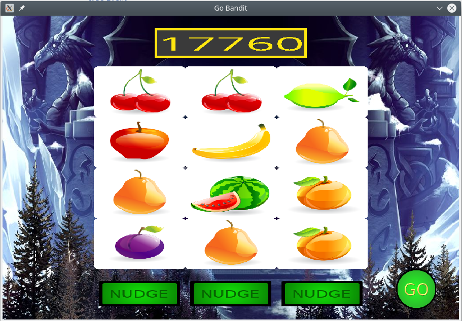

# gobandit

A flexible one arm Bandit game which emulates traditional and modern reel
based gambling games. GoBandit can also be considered a flexible plug-able game builder too.

Multi-face tile sets can be used to dress the reels, and a simple Fruit Reel set is included.
It has a configurable play board which enables up to 8 rows and columns, and auto-configures the board and tile sizes accordingly.

A plug-able Scoring system is also provided, enabling a variety of scoring mechanisms to be implemented, and accessed via a scorecard interface.

## Depends on SDL2

The game is built using the SDL2 library, thanks and cudos go to 
https://github.com/veandco/go-sdl2

Please see the go-sdl2 github page for instructions on installing SDL2 on your system.

## Extending as a Framework
GoBandit was designed to be extensible, and it is hoped that its simple decoupled structure will encourage development of many tile/reel based games with a variety of scoring and play mechanisms.

GoBandit builds upon Tiles, which are then accessed via the TileSet interface. Adding new tile sets is simple.  Create a folder with images named tilefacename_value.png or .jpg
the name value pairing will be split into string_int and loaded into the Tile.face and Tile.value respectively. Select the active Tile set via the config.

## Contributing

Please fo go ahead and fork this project, extend and raise Pull requests.
In addition we have a well labelled issues board.

## Documentation

There is developer documentation in the source tree, and in addition there are specifications and architecural diagrams and roadmap plans that can be found in the docs directory.

## Have Fun
This is a fun project, be creative and confident with your pull requests.